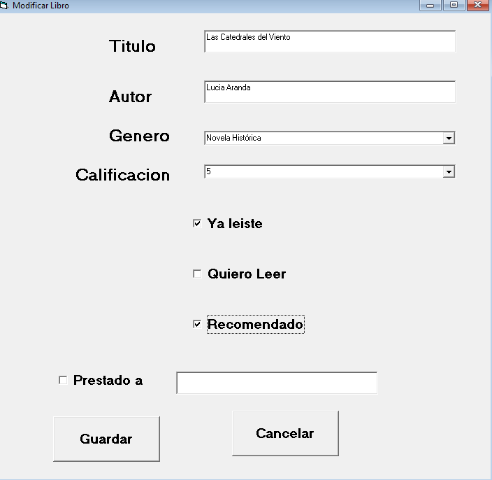

# LibreriaMega-VB6
Este es un proyecto por parte de Liderly y Mega para aprender las bases de Visual Basic 6 , mediante un tipo CRUD llamado Libreria Mega, este consiste de una aplicacion de escritorio que nos ayuda a administrar una libreria donde tenemos un boton de catalogo, ya leiste, no me gustaron entre otros. Tambien esta conectado a una BD de SQL. Nuestro challenger @josedejesusguzman
Tecnologías utilizadas: Visual Basic 6 y SQL Server.
Hecho por : Hector Daniel Gomez Medina
1- Catalogo mega. En este boton es el que muestra todo el catalogo de libros.

2- Ya leíste. Este boton nos sirve como filtro para los libros que ya se han leído.

3- Quiero leer. En este boton es el que muestra los libros que fueron marcados como quiero leer al ser agregados.

4- No me gustaron. En este boton es el que muestra todos los libros que tienen calificación 0 o están vacíos(NULL o sin calificación).

5- Todos los generos. En este boton es el que muestra todo el catalogo de generos que existen en la BD. En este caso se muestran los botones Agregar y eliminar genero favorito.

6- Generos favoritos. En este boton es el que filtra los datos para mostrar los generos que se marcaron como favoritos.En este caso se muestran los botones Agregar y eliminar genero favorito que nos ayudan a agregar o eliminar un genero favorito.

7- Libros favoritos. En este boton es el que filtra los libros que han sido calificados cuando fueron agregados con un 5.

    8- Veamos las peliculas que hay . 
    
    9- Vamos a probar el botón agregar. Este nos ayuda para agregar un libro, llenamos los campos que se necesiten, si se marca quiero leer se desmarcan las otras 2 y si se marca ya            leiste te deja marcar el recomendado.
    
    10- Veamos la imagen, ese libro ya agregado.
    
    11- Veamos la lista de libros eliminaremos la "fabula del relampago azul".
    
    12- Veamos la lista de libros de nuevo con el dato eliminado.
    
    13- Veamos el dato a modificar.
    
    14- Aquí se muestra el dato ya modificado.
    
    15- Por ultimo de nuevo el resultado después de todas las modificaciones..
    
# Diagrama E-R de la BD

# Descripcion de como lo hice
En este caso al ser una tecnologia legacy, para el diseno me base en la imagen que nos paso el challenger y use las bases que nos enseno en las clases, como tambien lei algunos foros y documentacion, ya que realmente hay muchas ideas que puedes implementar pero cuando te pones a leer la documentacion te das cuenta que tiene muchas limitantes a compracion de C#, al ser algun tipo de drag and drop visual, se me hizo facil gestionar la interfaz de usuario, ya solo la logica es aprender nueva sintaxis.
# Problemas conocidos
El unico problema conocido que no alcance a solucionar fue el como maniobrar para implementar una seccion, ventana o boton para gestionar los generos favoritos. Tenia algunas ideas pero el recorte de tiempo tuve que reorganizar mis prioridades.

    ## Tabla de retrospectiva
    
| ¿Qué salió bien? | ¿Qué no salió bien? | ¿Qué puedo mejorar? |
|------------------|---------------------|---------------------|
| La interfaz de usuario, limpia, simple y facil de usar. | Prevenir imprevistos, como el recorte de tiempo. | En este caso asimile muchas cosas, debi preguntar y leer y entender los requerimientos principales, asumi en vez de preguntas algunas cosas. |
